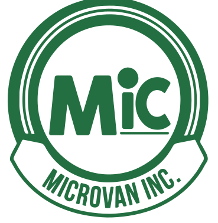

# Microvan Inc.
<!-- PROJECT LOGO -->
 

  
  <h3 align="center">Microvan Inc.</h3>

<!-- TABLE OF CONTENTS -->
  <h2 style="display: inline-block">Table of Contents</h2>
  <ol>
    <li>
      <a href="#about-the-project">About The Project</a>
      <ul>
        <li><a href="#built-with">Built With</a></li>
      </ul>
    </li>
    <li>
      <a href="#getting-started">Getting Started</a>
      <ul>
        <li><a href="#prerequisites">Prerequisites</a></li>
        <li><a href="#installation">Installation</a></li>
      </ul>
    </li>
    <li><a href="#deployment">Deployment</a></li>
    <li><a href="#contributing">Contributing</a></li>
  </ol>

<!-- ABOUT THE PROJECT -->
## About The Project

Microvan Inc. focuses on the importation, trade and sale of second-hand construction and industrial machinery, trucks and vehicles in the Philippines. Previously, Microvan Inc. would do in-person auctions every two months. However, due to the pandemic, many of their competitors have shifted to online auctions and Microvan Inc. needs a new auction site to ensure they aren't left behind.

### Built With

* Next JS - Frontend
* Django JS - Backend
* PostgreSQL - Database
* AWS - Hosting

<!-- GETTING STARTED -->
## Getting Started

To get a local copy up and running follow these simple steps.

### Prerequisites

* [NodeJS/npm](https://docs.npmjs.com/downloading-and-installing-node-js-and-npm)
* [Python/pip](https://packaging.python.org/en/latest/tutorials/installing-packages/)
* [pipenv](https://pipenv.pypa.io/en/latest/installation/)

### Installation
#### Django Backend

1. `cd` into backend folder
2. Make a copy of sample.env, rename it to .env, and fill out the environment variables.
3. run `pipenv install` to install dependencies
4. run `pipenv shell` to enter virtual environment
5. run `pipenv run start`

#### NextJS Frontend

1. `cd` into frontend folder
2. run `npm install` to install dependencies
3. run `npm start`

<!-- DEPLOYMENT -->
## Deployment

TODO

<!-- CONTRIBUTING -->
## Contributing

Contributions are what make the community such an amazing place to be learn, inspire, and create. Any contributions you make are **greatly appreciated**.

1. Create your Feature Branch (`git checkout -b feature/AmazingFeature`)
2. Commit your Changes (`git commit -m 'Add some AmazingFeature'`)
3. Push to the Branch (`git push origin feature/AmazingFeature`)
4. Open a Pull Request